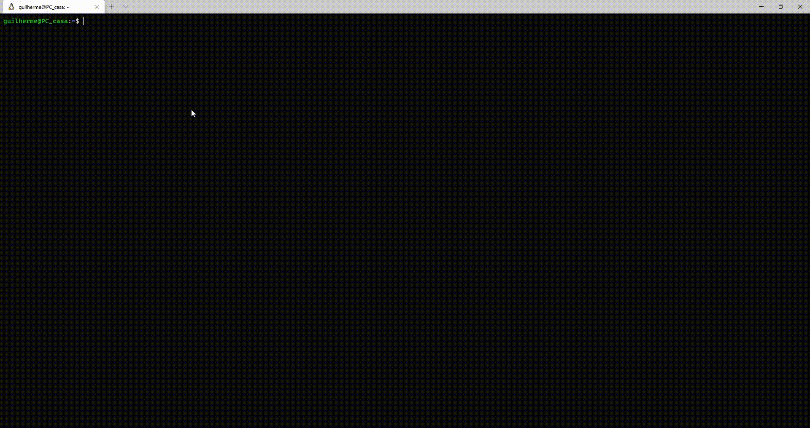

# Competitive Programming Language-Agnostic Toolkit

## Description

A toolkit for language-agnostic competitive programming, focused on _POSIX_ systems.

## Motivation

Even though C and C++ dominate the competitive programming ecosystem, it's not hard to spot some submissions using Python, Perl, Java, or even Fortran.
Every language has its pros and cons. Knowing many different languages can not only make you a better programmer but also a better competitor.

The problem is: keeping a polyglot development environment consistent and tidy is oftentimes harder than it may seem.
What this toolkit promotes is an abstraction for developing with different programming languages at once.

## Mechanism

Even though powerful, the toolkit only needs to remember one thing: the current programming language.
With this information, it triggers all the functionalities specific to that programming language.
For example, running a C++ application involves one list of commands; while running a Python script
involves a different list. But for the user, these are abstracted away into a single command: `./run`.

**The current programming language is the one that was last made explicit in a command.**

These commands can also take additional arguments. For example, compiling a C++ application may take custom compiler flags as in `./run c++ -std=c++17`. Note that when additional arguments are present, the programming language name must be explicit, even when it is the default.

After cloning this repository, you need to define the programming language for the first time, by running, for example, `./src LANGUAGE`.

## Dependencies

### Core dependencies

* [bash]

### Peripherals dependencies

* **Editing**: [vim]
* **Clipboard**: [xclip] or [clip.exe]

### Languages dependencies

Since the project deals with a bunch of different languages, it's quite natural the need to have some software pre-installed on your machine.
Since you're most likely to work with only a few portion of them, the following table should summarize which are the dependencies that apply to your usage.

| Programming Language | Compiling and running | Debugging |
| :- | :- | :- |
| c | [gcc], [make] | :heavy_check_mark: [gdb] |
| c++ | [g++], [make] | :heavy_check_mark: [gdb] |
| c# | [mcs], [make] | :heavy_check_mark: [gdb] [(1)] |
| go | [go], [make] | :heavy_check_mark: [gdb] [(2)] |
| haskell | [ghc], [make] | :heavy_check_mark: [gdb] [(4)] |
| java | [javac], [java], [make] | :heavy_check_mark: [jdb] |
| kotlin | [kotlinc], [java], [make] | :x: |
| pascal | [fpc], [make] | :heavy_check_mark: [gdb] [(3)] |
| perl | [perl] | :heavy_check_mark: |
| python | [python] | :heavy_check_mark: |
| ruby | [ruby] | :heavy_check_mark: |

## Commands

All the commands are summarized in the table below. For more information on each command, such as extra arguments, read the documentation in each file.

| Command | Description |
| :- | :- |
| `bin` | Get binary file path |
| `cat` | Write stdin to source file |
| `clear` | Clear temporary files for the current language |
| `clearall` | Clear temporary files for all languages |
| `clip` | Copy source file to clipboard |
| `list` | List all available languages |
| `load` | Load a saved project of a specific language |
| `prjlist` | List all projects of a specific language |
| `run` | Run program of the current language |
| `rund` | Run program of the current language on debug mode |
| `save` | Save current program as a project |
| `src` | Get source file path |

## Contribution

If you have a language that you'd like to be added, don't hesitate to send a pull request.

[(1)]: https://www.mono-project.com/docs/debug+profile/debug/#debugging-with-gdb
[(2)]: https://golang.org/doc/gdb
[(3)]: https://www.freepascal.org/docs-html/user/userse54.html#x165-17200010.2
[(4)]: https://downloads.haskell.org/~ghc/latest/docs/html/users_guide/debug-info.html
[bash]: https://www.gnu.org/software/bash/
[clip.exe]: https://docs.microsoft.com/en-us/windows/wsl/about
[fpc]: https://www.freepascal.org/
[g++]: https://gcc.gnu.org/
[gcc]: https://gcc.gnu.org/
[gdb]: https://www.gnu.org/software/gdb/
[ghc]: https://www.haskell.org/ghc/
[go]: https://golang.org/
[java]: https://docs.oracle.com/javase/7/docs/technotes/tools/windows/java.html
[javac]: https://docs.oracle.com/javase/7/docs/technotes/tools/windows/javac.html
[jdb]: https://docs.oracle.com/javase/7/docs/technotes/tools/windows/jdb.htm
[kotlinc]: https://kotlinlang.org/docs/tutorials/command-line.html
[make]: https://www.gnu.org/software/make/
[mcs]: https://www.mono-project.com/
[perl]: https://www.perl.org/
[python]: https://www.python.org/
[ruby]: https://www.ruby-lang.org/en/
[vim]: https://www.vim.org/
[xclip]: https://linux.die.net/man/1/xclip
